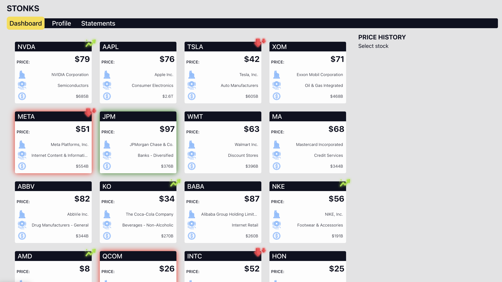
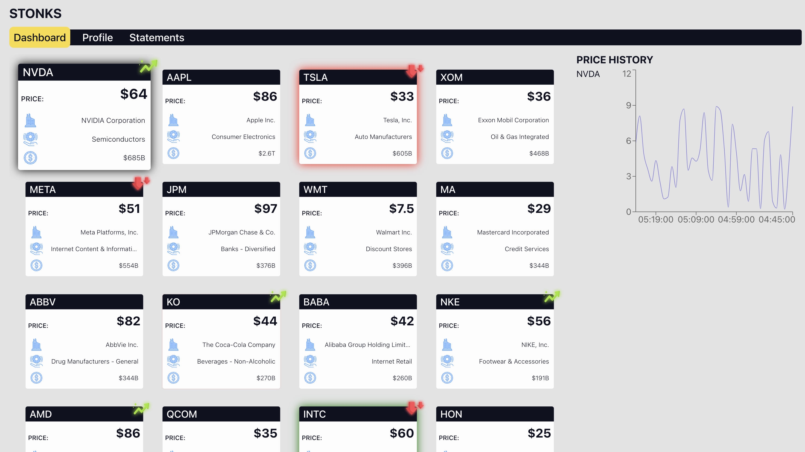
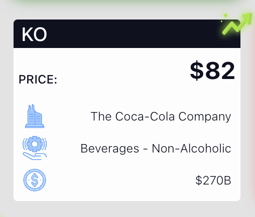
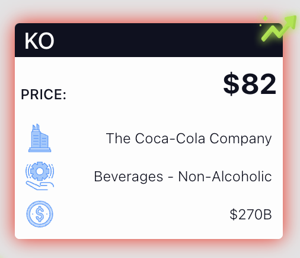
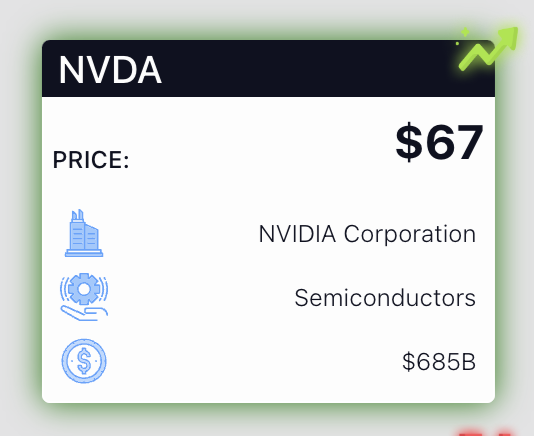

# REQUIREMENTS

## General Requirements

- You need to replicate the functionality and design as closely as possible to what is shown in the videos and images.
  - ### Specifically, the following is absolutely required:
    - The general layout and design of the `Dashboard`.
      - The Navbar.
      - The Cards container 
        - The scroll for the cards container.
    - The layout change between desktop and mobile devices.
    - The implementation of the `SymbolCard` should be as granular as possible, i.e. SymbolCard should be a "smart" component built with "dumb" components. 
      - The effects (Red/Green glow for price changes, the shake animation and the scale up/down when a card is selected).
    - #### Everything else is a bonus and up to you
  
- **The final solution should be highly optimized and implemented as efficiently as possible. In other words, the number of re-renders of the components and the bundle size on initial load should be as low 
as possible.** For example:
    * When the effects are active (shaking, glowing, etc.) the children of the component should not be re-rendered.
    * You should avoid re-rendering the whole component when only a part of it needs to be updated.
    * *(Hint: For the initial bundle size, in [router/index.tsx](frontend/src/router/index.tsx), something combined with `Suspense` will get you there.)*

- **Please ensure that the code you submit reflects your best work and you use best practices.**

- **The commit history should be granular with descriptive commit comments**

- **You should write custom CSS (in other words, do not use UI Libraries). Using [BEM methodology](https://getbem.com/naming/) for CSS classes is a nice to have but not required.**

- **Consider creating separate components for repeating elements.**

- **Avoid writing inline styles.**

### Important Note
There are embedded videos which show the expected design, responsiveness and behaviour of the application/components.
They may not work with every MARKDOWN rendering engine, so above each video there is a link to the video file as well.

You can find these videos and images in the [instruction_assets](instruction_assets) folder.

### Video and image preview of the expected final result.
[FullPreview.mp4](instruction_assets/FullPreview.mp4)
<video width="320" height="240" controls>
  <source src="instruction_assets/FullPreview.mp4" type="video/mp4">
</video>
[Alt Text](/instruction_assets/dashboard_card_active.png)
[FullPreview.mp4](instruction_assets/FullPreview.mp4)

## Dashboard Page Layout

[ResponsivenessAndLayout.mp4](instruction_assets/ResponsivenessAndLayout.mp4)
<video width="320" height="240" controls>
  <source src="instruction_assets/ResponsivenessAndLayout.mp4" type="video/mp4">
</video>

The layout consists of a `heading`, `navigation`, `stock cards list` and `price chart`.
The layout should be responsive and should be able to be displayed on desktop, tablet and mobile devices.
- On desktop devices the price chart should take `400px` of the width. The remaining 
width should be used for the stock cards list.
- On tablet/mobile and other devices with screen smaller than `1024px`, the price chart should be displayed above the
stock cards list.

### Stock Card List

The cards should be displayed in a responsive container. The container
should take the remaining of the height from the page
- bellow the title and navigation on desktop
- bellow the title, navigation and chart on tablet/mobile

#### User Actions:
[CardsSelection.mp4](instruction_assets/CardsSelection.mp4)
<video width="320" height="240" controls>
  <source src="instruction_assets/CardsSelection.mp4" type="video/mp4">
</video>

- The user should be able to select a stock card by clicking on it. When a card is selected, it should be highlighted
with black shadow and scaled up by around 2-4%. (Check video/images)
- If there is an active/selected card, the other cards should be scaled down by around 2-4%. (Check video/images)

### Price Chart

The price chart should show the price history of the selected stock. It should be visible only when a stock is selected.
The API call functionality is implemented. There is a small flaw in the implementation in the hook which can cause unintended behaviour.
Try to fix this. 

*(Hint: The flaw is in the `useEffect` hook. If for any reason the user has a slow connection, 
sometimes the price chart won't behave as expected)*

### Stock Card

**The stock card should be a responsive component.**

[SymbolCardEffects.mp4](instruction_assets/SymbolCardEffects.mp4)
<video width="320" height="240" controls>
  <source src="instruction_assets/SymbolCardEffects.mp4" type="video/mp4">
</video>

#### Variations
- Default *(no trend)*
- Positive trend *(green upwards arrow)*
- Negative trend *(red downwards arrows)*

#### Fields

- **Header**: Header title is the stock symbol. On the right side of the header there is a
trend marker (only if the trend is available)

- **Trend Marker**: Some stocks may have a positive or negative
trend which is indicated by **green** *(positive)* and **red** *(negative)* arrows.
Assets for this can be found in the [frontend/src/assets](frontend/src/assets) folder.
- `assets` folder.

- **Price** *(in USD)*: Formatted price of the stock.
- **Company Name, Industry and Market cap**: Info fields about the stock.
Assets for this can be found in the [frontend/src/assets](frontend/src/assets) folder.

#### Animations/Interactions
- If the price changes for more than 25% from the previous price, the card should shake 
  - The shake animation class can be found in the [frontend/src/components/SymbolCard/symbolCard.css](frontend/src/components/SymbolCard/symbolCard.css) `symbolCard__shake`.
- If the last price change is positive, the card should flash with green shadow. (Check videos)
- If the last price change is negative, the card should flash with red shadow. (Check videos)
- If the card is currently selected, it should have a black shadow around it. (Check videos)
  - **IMPORTANT**: The flashing shadow from the price changes takes precedence over the black shadow. (Check videos)

### Bonus points for using custom hooks, especially for the **animations** and **effects (box shadow)**

### ESTIMATED TIME: 2-4 hours